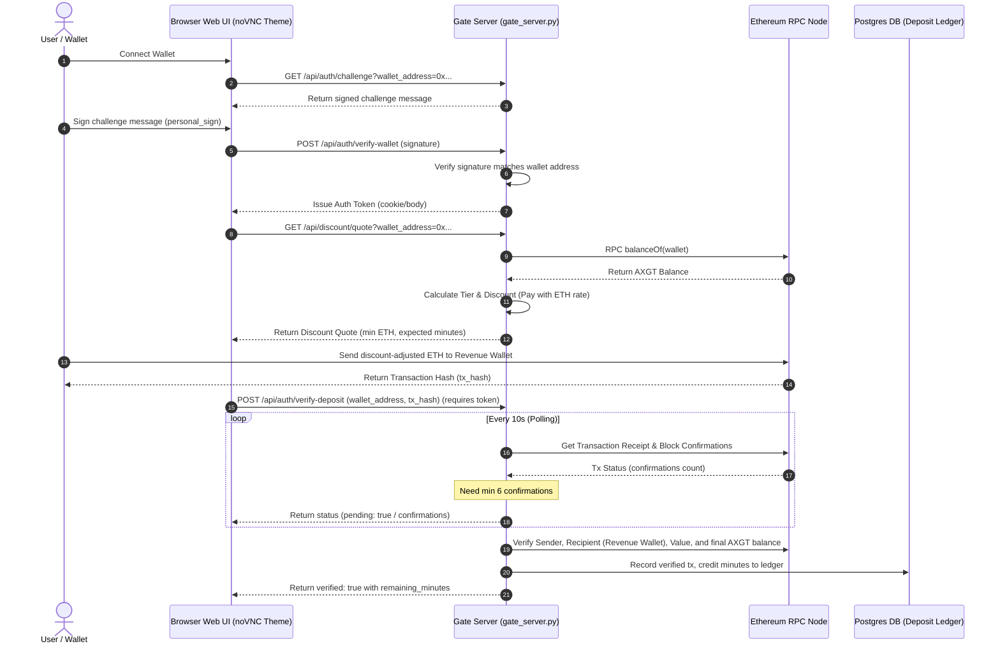
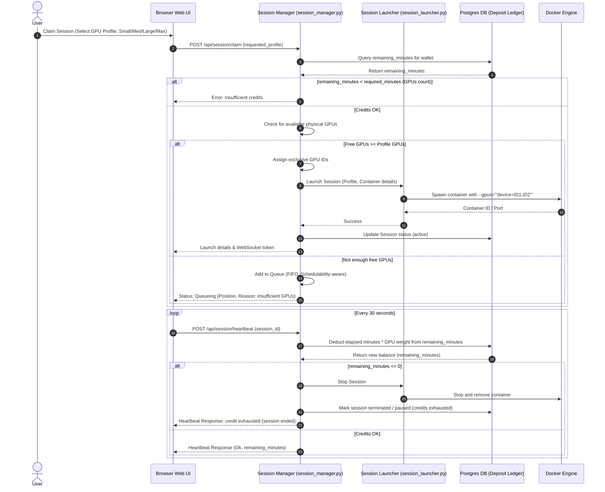

# 🧬 AxonOS Technical User Flow & System Architecture

This document outlines the workflows and architecture of the AxonOS gateway, billing verification engine, and session orchestration layer.

---

## 🏛️ 1. High-Level System Architecture

The client communicates with the gated server using standard WebSockets and HTTPS endpoints. The gated server verifies Web3 signatures, indexes on-chain deposit logs via an Ethereum RPC node, persists credit balances in PostgreSQL, and schedules session containers dynamically using local Docker CLI or a remote HTTP launcher service.

```mermaid
graph TD
    Client["Web Browser (noVNC Theme / UI)"] <--> |Port 6080: WebSockets & HTTP| Gate["Gate Server (websockify_gate.py / gate_server.py)"]
    Gate <--> |Auth, Deposit & Audit Ledgers| DB[("PostgreSQL DB (axgt_deposits, axgt_ledger)")]
    Gate <--> |JSON-RPC (balanceOf & tx checks)| EthRPC["Ethereum RPC Node (Mainnet)"]
    Gate --> |Claim / Heartbeat / Queue| SM["Session Manager (session_manager.py)"]
    SM --> |Spawn / Stop Adapter| SL["Session Launcher (session_launcher.py)"]
    SL --> |"Launcher Mode (CLI or HTTP API)"| HostLauncher["Host Docker Launcher / CLI"]
    HostLauncher --> |Manage Lifecycle| DockerContainers["AxonOS Desktop Containers (XFCE, Assistant, VNC)"]
    DockerContainers -.-> |VNC Stream via WebSocket| Client
```

---

## 🔑 2. Web3 Authentication & Deposit-Credit Flow

Users must prove wallet ownership via an EIP-191 challenge-signature process. Once authenticated, users can retrieve a server-calculated discount quote based on their current on-chain AXGT balance. Paying the discounted ETH amount to the revenue wallet grants user minutes after transaction confirmation checks.



---

## ⚡ 3. GPU Session Scheduler & Billing Heartbeat

During session creation, the client claims a resource profile (e.g. Small, Medium, Large, or Max). The scheduler assigns physical GPUs exclusively. If resources are constrained, users are queued fairly based on runnability. During active sessions, client heartbeats incrementally bill credits proportional to the profile's GPU weight.


